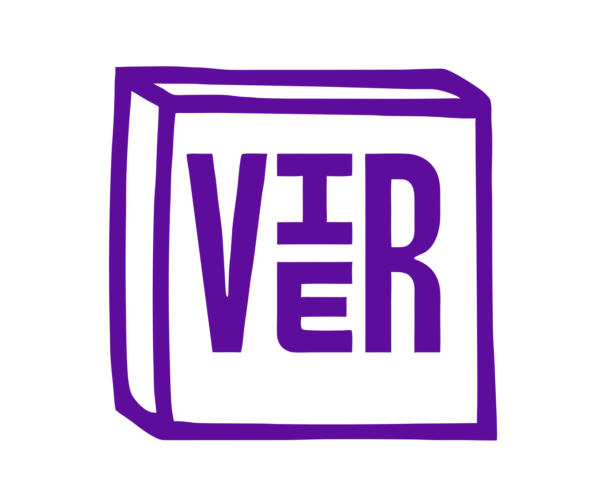
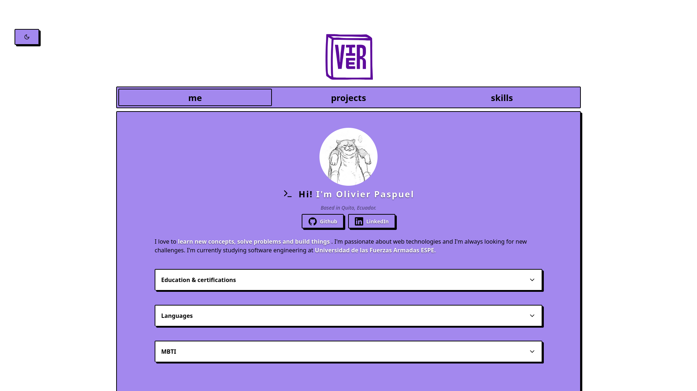
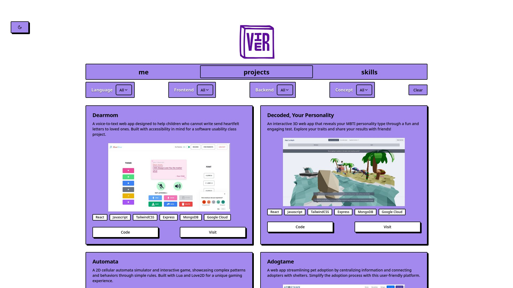
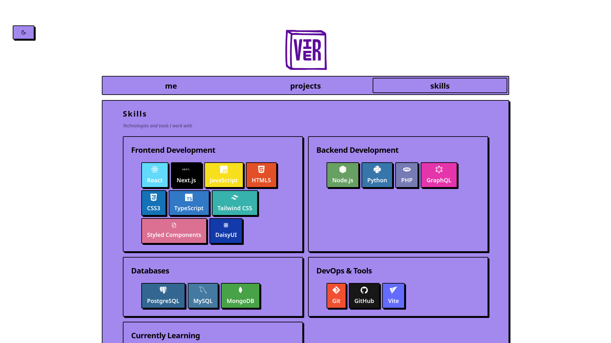
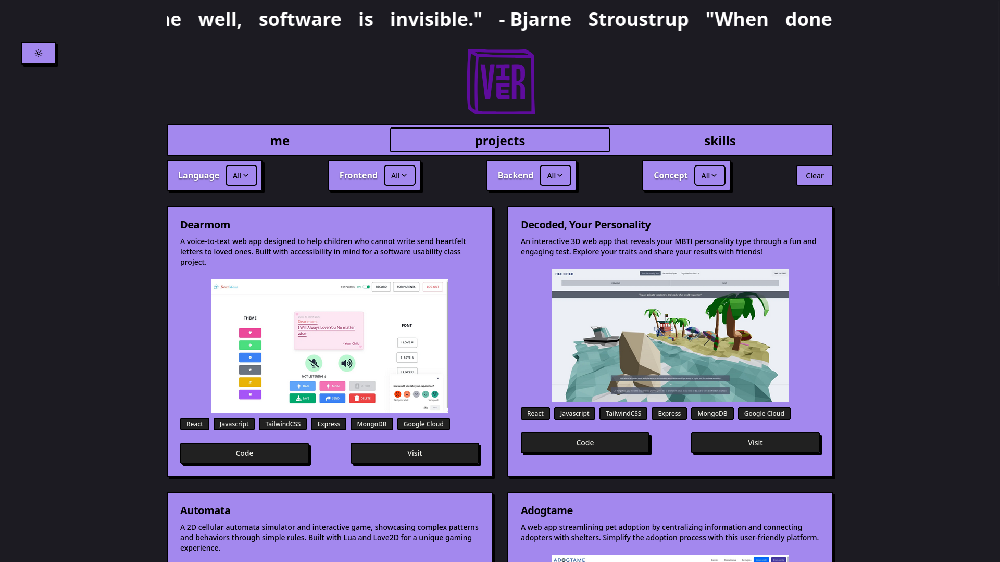

# Personal Portfolio



This project showcases my skills, projects, and relevant information as a software developer (currently SWE student).
[](https://vieerr.vercel.app)

## Sections

- **me**: A brief bio introducing myself and revant academic information.
- **projects**: A showcase of my key projects with descriptions, technologies used, and links to live demos or repositories.
- **skills**: A breakdown of my technical skills, including frontend, backend, database, and DevOps expertise.

## Features

- **Responsive Design**: Optimized for all devices, ensuring a seamless experience on desktop, tablet, and mobile.
- **Interactive UI**: Smooth animations and transitions for an engaging user experience.
- **Easter Egg**: Check dark theme **ᕙ⁠(⁠⇀⁠‸⁠↼⁠‶⁠)⁠ᕗ**

## Technologies Used

This portfolio is built using the following technologies:

- **Frontend**: Next.js
- **DevOps**: Vercel, Git, GitHub
- **Styling**: TailwindCSS, DaisyUI, Neobrutalism Components, Lucide Icons

For a full list of dependencies, check out the [`package.json`](./package.json) file.

## Installation

To run this project locally, follow these steps:

1. Clone the repository:
   ```bash
   git clone https://github.com/vieerr/portfolio.git
   cd portfolio
   ```
2. Install dependencies:
   ```bash
   pnpm install
   ```
3. Initialize the project:
   ```bash
   pnpm run dev
   ```
4. Open the project in your browser:
   ```bash
   http://localhost:3000
   ```

## Usage

Visit the live portfolio at [vieerr.vercel.app](https://vieerr.vercel.app) to explore my work. Navigate through the tabs to learn more about me, my projects, and my skills.

## Screenshots

Here are some screenshots of the portfolio:

### About me section



### Projects Section



### Skills Section



### Dark Theme



## License

This project is unlicensed. All rights reserved.

## Acknowledgments

I would like to thank the following resources and projects

- **[Neobrutalism Components](https://github.com/ekmas/neobrutalism-components)**: For the aesthetic and design inspiration.

## Contact

Feel free to reach out to me via:

- **GitHub**: [@vieerr](https://github.com/vieerr)
- **LinkedIn**: [Olivier Paspuel](https://www.linkedin.com/in/olivier-paspuel-18909b244/)
- **Email**: [olivier.paspuel@gmail.com](mailto:olivier.paspuel@gmail.com)
